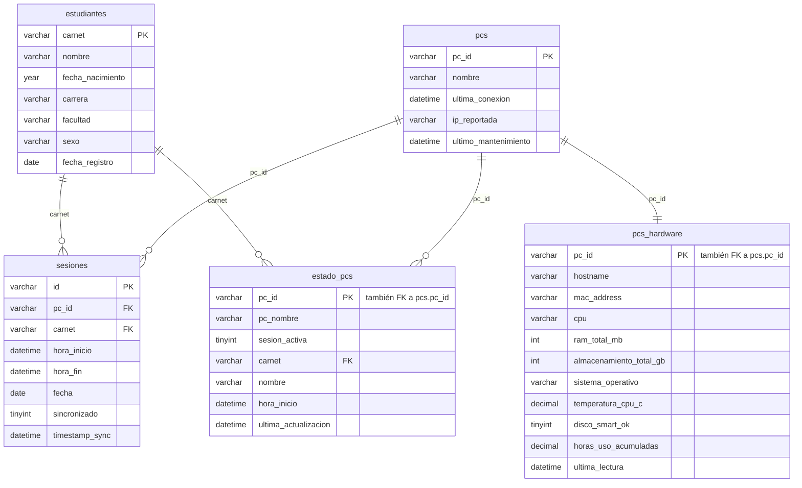

# Esquema de base de datos — Biblioteca Control de Acceso

Fuente de verdad: [`schema.py`](./schema.py) (`init_db()`), ejecutado en cada
arranque del servidor. No hay sistema de migraciones formal: los cambios de
esquema se aplican como `ALTER TABLE` idempotentes al final de `init_db()`.
Este documento refleja el estado **final** (tras esas migraciones).

Motor: MySQL, `ENGINE=InnoDB` en todas las tablas.

## Diagrama de relaciones

## Tablas

### `estudiantes`

| Columna | Tipo | Notas |
|---|---|---|
| `carnet` | `VARCHAR(30)` | **PK** |
| `nombre` | `VARCHAR(255)` | |
| `fecha_nacimiento` | `YEAR` | Solo año (el kiosko no captura fecha completa). Migrada desde `DATE` — ver nota abajo. |
| `carrera` | `VARCHAR(255)` | |
| `facultad` | `VARCHAR(255)` | |
| `sexo` | `VARCHAR(20)` | |
| `fecha_registro` | `DATE` | `NOT NULL` |

> `departamento` existió en versiones anteriores y se elimina automáticamente
> si `init_db()` la encuentra.

### `pcs`

Catálogo de equipos (kioscos) registrados.

| Columna | Tipo | Notas |
|---|---|---|
| `pc_id` | `VARCHAR(100)` | **PK** |
| `nombre` | `VARCHAR(255)` | |
| `ultima_conexion` | `DATETIME` | |
| `ip_reportada` | `VARCHAR(45)` | IPv4/IPv6 |
| `ultimo_mantenimiento` | `DATETIME` | Añadida por migración (`ALTER TABLE ... ADD COLUMN`) |

### `sesiones`

Historial de sesiones de uso (una fila por sesión, sincronizada desde los kioscos).

| Columna | Tipo | Notas |
|---|---|---|
| `id` | `VARCHAR(100)` | **PK** |
| `pc_id` | `VARCHAR(100)` | `NOT NULL` · **FK** → `pcs.pc_id` |
| `carnet` | `VARCHAR(30)` | **FK** → `estudiantes.carnet` · nullable (sesiones de invitado) |
| `hora_inicio` | `DATETIME` | `NOT NULL` |
| `hora_fin` | `DATETIME` | |
| `fecha` | `DATE` | `NOT NULL` |
| `sincronizado` | `TINYINT(1)` | default `0` |
| `timestamp_sync` | `DATETIME` | |

Índices: `idx_sesiones_fecha (fecha)`, `idx_sesiones_carnet (carnet)`, `idx_sesiones_pc_id (pc_id)`.

### `estado_pcs`

Snapshot del estado actual de cada PC (una fila por PC, se sobrescribe).

| Columna | Tipo | Notas |
|---|---|---|
| `pc_id` | `VARCHAR(100)` | **PK** · **FK** → `pcs.pc_id` |
| `pc_nombre` | `VARCHAR(255)` | |
| `sesion_activa` | `TINYINT(1)` | default `0` |
| `carnet` | `VARCHAR(30)` | **FK** → `estudiantes.carnet` · `ON DELETE SET NULL` |
| `nombre` | `VARCHAR(255)` | nombre del estudiante en la sesión activa (denormalizado) |
| `hora_inicio` | `DATETIME` | |
| `ultima_actualizacion` | `DATETIME` | |

### `pcs_hardware`

Telemetría de hardware por PC (una fila por PC, se sobrescribe).

| Columna | Tipo | Notas |
|---|---|---|
| `pc_id` | `VARCHAR(100)` | **PK** · **FK** → `pcs.pc_id` |
| `hostname` | `VARCHAR(255)` | |
| `mac_address` | `VARCHAR(20)` | |
| `cpu` | `VARCHAR(255)` | |
| `ram_total_mb` | `INT` | |
| `almacenamiento_total_gb` | `INT` | |
| `sistema_operativo` | `VARCHAR(255)` | |
| `temperatura_cpu_c` | `DECIMAL(5,1)` | |
| `disco_smart_ok` | `TINYINT(1)` | |
| `horas_uso_acumuladas` | `DECIMAL(8,2)` | `NOT NULL DEFAULT 0` |
| `ultima_lectura` | `DATETIME` | |

## Notas de migración vigentes

- `sesiones.carnet` se relajó a `NULL` (permite sesiones de invitado sin carnet).
- `estudiantes.fecha_nacimiento`: si una base preexistente la tiene como `DATE`,
  se migra a `YEAR` vía columna auxiliar (`fecha_nacimiento_new`) para evitar
  que MySQL trunque el valor a `0000` en un `MODIFY` directo.
